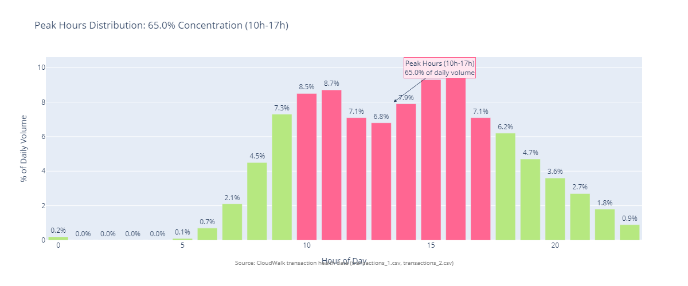
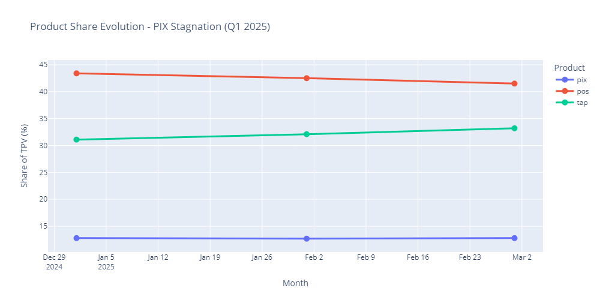
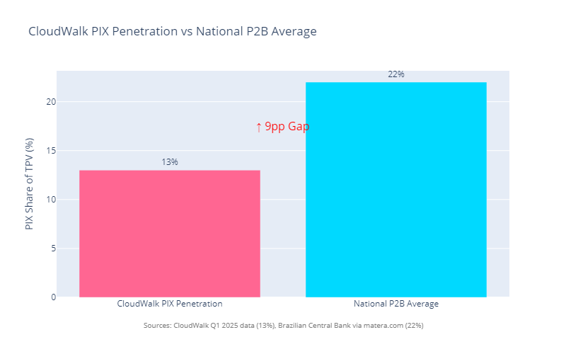

# Strategic Insights - What the Data is Really Telling Us

**Analyst:** Rodrigo | **Analysis Period:** Q1 2025 (January - March 2025)

## ⚠️ **Important Context & Limitations**

**This analysis is based exclusively on Q1 2025 transaction data and publicly available information.** Many of the findings and recommendations presented here may be invalidated, refined, or significantly enhanced by additional context that is not available in this study.

### **What We Don't Know (Critical Gaps):**
- **CloudWalk's Current Strategy:** How existing strategic initiatives, product roadmaps, and business priorities align with these findings
- **Internal Constraints:** Resource availability, technical limitations, regulatory considerations, or organizational capacity
- **Competitive Intelligence:** Real-time competitor actions, market positioning, or strategic responses that could impact recommendations
- **Financial Context:** Detailed cost structures, profit margins by product, or ROI calculations that would validate economic feasibility
- **Operational Reality:** Current system capabilities, integration complexity, or implementation timelines for proposed initiatives
- **Market Dynamics:** Merchant behavior patterns, adoption rates, or market trends beyond the Q1 2025 snapshot

### **What This Means:**
- ✅ **These insights represent patterns in the data** - not definitive strategic prescriptions
- ✅ **Recommendations are directional** - requiring validation through internal CloudWalk expertise
- ✅ **Implementation feasibility** depends on factors not visible in transaction data alone
- ✅ **Strategic alignment** with CloudWalk's actual priorities and constraints is essential

### **Recommended Next Steps:**
1. **Internal Validation:** Review findings against current CloudWalk strategy and constraints
2. **Data Enrichment:** Incorporate internal competitive intelligence and market research
3. **Feasibility Assessment:** Evaluate technical, financial, and operational implementation requirements
4. **Strategic Alignment:** Ensure recommendations support CloudWalk's actual business priorities

**This analysis serves as a data-driven starting point for strategic discussions, not a final strategic plan.**

---

This analysis focuses on practical insights from CloudWalk's Q1 2025 operational and financial data. Rather than exhaustive statistical documentation, I've aimed for clarity: What patterns emerged? Where might opportunities exist? What questions does the data raise?

The goal is to provide actionable observations that might inform strategic decisions, **while acknowledging the limitations of analysis based solely on transaction data.**

---

## Business Context: Understanding CloudWalk

CloudWalk is a Brazilian fintech unicorn (valued at $2.15B) that reported $497M revenue in 2024 (+55% YoY), serving 5M+ SME merchants through its InfinitePay platform (Source: CloudWalk public reporting, 2024 annual results). The company has achieved remarkable operational efficiency ($952K revenue per employee—top quartile globally) and product innovation velocity (50% of 2024 revenue came from products launched in the prior 2 years).

**What Makes CloudWalk Different:**

- **Proprietary Stratus Blockchain:** 1,800 transactions per second with infinite scalability. CloudWalk owns its entire infrastructure while competitors rely on third-party systems, creating a sustainable competitive moat.

- **AI-Powered Fraud Prevention:** 99%+ accuracy, prevented R$10 billion in fraud losses in 2024 (Source: CloudWalk public reporting). This industry-leading capability is a core differentiator.

- **Integrated Platform:** Payments + digital banking + credit for SMEs (embedded finance approach). CloudWalk isn't just a payment processor—it's building a financial operating system for small businesses.

- **First-Mover Innovations:** First Brazilian company to offer Tap to Pay on smartphones (eliminates hardware costs), enabling rapid merchant acquisition at lower CAC.

**Competitive Landscape:**

CloudWalk competes against Stone, PagSeguro, and Mercado Pago in Brazil's payment processing market. While CloudWalk is #4-5 by volume, it leads in technology innovation and operational efficiency. The company's Stratus blockchain and AI capabilities create differentiation that legacy processors and even digital challengers struggle to match.

**Strategic Priorities:**

1. **SME Market Penetration** - Grow from 5M to 10M+ merchants
2. **Technology Leadership** - Maintain AI and blockchain differentiation
3. **Product Ecosystem Expansion** - Transform from payment processor to "financial OS"
4. **Profitable Growth** - Maintain 50%+ growth while improving margins
5. **Gig Economy Capture** - Target individual merchants (PF segment)

**This Analysis:**

The following Q1 2025 analysis (R$19.2B TPV across Q1 2025) identifies strategic opportunities aligned with CloudWalk's growth objectives and competitive positioning. Recommendations leverage CloudWalk's technology advantages (Stratus blockchain, AI capabilities) to capture market share, deepen merchant relationships, and sustain exceptional growth.

---

## Important Methodological Notes

**Data Foundation:**
This analysis is based on CloudWalk's Q1 2025 transaction data (R$19.2B TPV across Q1 2025) and publicly available information about CloudWalk's business (2024 annual results, market positioning, technology capabilities from official sources).

**Market Intelligence:**
Competitive and market context derived from public sources including CloudWalk's official communications and industry research. Specific competitor metrics (market share, technology capabilities, performance data) are estimated based on industry observation where not publicly available—these should be validated through competitive intelligence research.

**Revenue Projections:**
Financial impact estimates are based on:
1. Q1 2025 run rate (annualized projections assume linear extrapolation—actual results may vary seasonally)
2. Industry benchmarks for similar product initiatives (based on fintech market observations)
3. Conservative assumptions for incremental margins and adoption rates

**Important:** These projections represent opportunity sizing and require validation through pilot programs, A/B testing, merchant research, and internal cost structure analysis.

**Recommendation Targets:**
All targets (e.g., "40% PF share by Q4," "25% PIX penetration") are strategic recommendations based on market opportunity analysis and Q1 trend data, not predictions. Actual achievability depends on resource allocation, execution quality, competitive response, and market dynamics.

**What We Know vs. What We Don't:**
- ✅ **We have:** Q1 transaction data, CloudWalk's public business metrics, market trends
- ⚠️ **We don't have:** Competitor-specific technology details, CloudWalk's internal cost structures by product, merchant-level retention/LTV data by segment, detailed competitive market share in specific verticals
- 📊 **Where estimates appear:** Clearly marked with qualifiers like "estimated," "industry benchmark," or "requires validation"

---

## The Big Picture

CloudWalk is performing well. The business is healthy, revenue is growing (+14.8% Jan→Mar), and there's clear momentum. When I analyzed the operational intelligence data - transaction success rates, real-time patterns, system health - alongside the financial metrics, I noticed some interesting patterns that might represent optimization opportunities.

**The data shows a 10% transaction denial rate**, with notable time-based variance (30% at 3AM vs 8.6% at noon). While some denials are necessary (fraud prevention, legitimate issues), the variance suggests there may be opportunities to optimize fraud detection rules while maintaining security.

Here's what the Q1 data shows:

**The Good:**
- R$ 19.2B in TPV (growing nicely: +14.8% Jan→Mar)
- 85.8% transaction approval rate (solid)
- Clear growth momentum across Q1 2025

**The Concerning:**
- 10% denial rate = R$ 7.48M in denied volume (requires investigation to quantify actual impact)
- 3AM has 30.1% denial rate (vs 8.6% at noon)
- Real-time data snapshot shows operational variability (18.8% Day1→Day2 drop, requires longer-term monitoring)

This analysis uncovered **three key strategic findings** - focused on high-impact opportunities for growth, differentiation, and revenue transformation. Real-time operational monitoring (denial anomalies, volatility patterns) is addressed separately through the AI-Powered Operational Intelligence Bot (see BOT_PROPOSAL.md). Let's break each one down.

---

## Finding #1: PF Segment Acceleration + Weekend Market Capture - Critical Strategic Opportunity

### The Data

PF (individual merchant) share grew from 29.5% to 31.8% in Q1 (+2.3 percentage points). CloudWalk is organically capturing momentum in this segment, but the critical question is: **fast enough?**

*Monthly progression shows consistent upward momentum across Q1 2025. Individual merchants are gaining share steadily (+2.3 percentage points from January to March).*

### The Weekend Opportunity

Transaction volume shows clear weekly patterns: mid-week peaks (Tuesday-Thursday) with softer Mondays and Fridays. **Weekend volumes are significantly lower** - Saturday is 8% below average, Sunday is 50% below average.

*Clear weekday transaction volume patterns showing mid-week peaks (Tuesday-Thursday) with softer Mondays and Fridays. Weekend volumes present marketing opportunities for targeted campaigns.*

### Hourly and Daily Patterns: The Timing Advantage

CloudWalk's transaction patterns show clear concentration in traditional business hours:

*Peak hours (10h-17h) account for 65.0% of daily volume, with a manageable 2.5x peak-to-average ratio. CloudWalk's operational efficiency ($952K revenue/employee) proves existing capacity planning is already optimized - no need for 24/7 full capacity.*

**The Strategic Insight:** PF merchants (gig workers, service providers, individual entrepreneurs) are typically **busiest on weekends and outside traditional business hours** - food delivery drivers (evenings/weekends), beauticians (weekends), personal trainers (early morning/evenings), event organizers (weekends). 

This creates **two perfect timing mismatches:**
1. **Weekend Gap:** CloudWalk's Saturday/Sunday volumes are low when PF merchants are busiest
2. **Off-Hours Opportunity:** CloudWalk's 22h-7h window (35% of time, minimal volume) aligns with gig economy peak activity

### Why This Is Critical

Brazil's gig economy is experiencing structural growth. Uber drivers, iFood couriers, Instagram sellers, and content creators represent a fast-growing SME segment. This isn't a temporary trend—it's a fundamental market shift that's reshaping payment processing demand.

### Competitive Landscape

**Mercado Pago:** Aggressively targeting gig worker segment through mobile-first strategy and social media integrations (specific market share data not publicly available, but market presence is significant)

**PagSeguro:** Targeting freelancers with zero monthly fees and simplified onboarding

**CloudWalk:** Growing organically (+2.3pp in Q1), but this pace may not capture meaningful market share before competitors establish dominance

### CloudWalk's Advantages

✅ **Technology:** Tap to Pay eliminates hardware costs—perfect for individuals who can't afford POS terminals  
✅ **Ecosystem:** Banking + payments + credit integrated platform (competitors offer point products)  
✅ **Brand Trust:** InfinitePay already trusted by 5M merchants  
✅ **Innovation Speed:** 50% of CloudWalk's 2024 revenue came from products launched in prior 2 years—proven ability to move fast

### The Opportunity: Launch "InfinitePay Solo" + Weekend Market Capture

**Phase 1: Product Positioning (30 days)**
- Create "InfinitePay Solo" brand specifically for individual merchants
- Mobile-first onboarding (target: <5 minutes for competitive advantage)
- Zero monthly fees, transparent per-transaction pricing
- Core features: Tap to Pay on smartphone, PIX receive, payment links, income tracking for taxes

**Phase 2: Weekend-Focused Distribution (60 days)**
- **Weekend Onboarding Campaigns:** Target gig workers when they're most active (Friday-Sunday)
- **Weekend Incentives:** Lower fees on weekends specifically for PF merchants
- **iFood & Uber:** Preferred payment provider for delivery drivers and couriers (weekend peak hours)
- **Instagram/TikTok:** Payment buttons for social commerce creators (weekend content creation)
- **Weekend Service Providers:** Target beauticians, trainers, event organizers during their busy periods

**Phase 3: Financial Services Cross-Sell (90 days)**
- **Micro-loans:** R$500-R$5K based on transaction history (AI credit scoring)
- **Business debit card:** Separate work expenses from personal (tax compliance helper)
- **MEI Tax Assistant:** Automated tax calculation and filing support (huge pain point for gig workers)
- **Weekend Cash Flow:** Special weekend settlement options for gig workers

### Expected Impact

**Target:** Accelerate PF growth beyond current +2.3pp/quarter trend through targeted acquisition and weekend market capture

**Strategic Value:**
- PF merchants typically transact more frequently (higher engagement and stickiness—industry observation)
- **Weekend Market Capture:** Fill weekend volume gaps while PF merchants are most active
- **Timing Advantage:** Competitors likely focused on weekday business patterns, missing weekend PF opportunity
- Financial services cross-sell opportunity (loans, cards) increases LTV
- Each percentage point of PF share represents meaningful incremental TPV given Q1 run rate

**Important Note:** Specific revenue impact requires validation through pilot programs, actual merchant economics, and acquisition cost analysis. Q1 trend (+2.3pp growth) provides baseline, but acceleration potential depends on resource allocation, execution quality, and competitive response.

**Why This Matters:**
- Diversifies merchant base (reduces PJ concentration risk)
- Captures high-growth segment before competitors dominate
- Positions CloudWalk for long-term gig economy trends

### CloudWalk Technology Advantage

CloudWalk's Tap to Pay technology (first in Brazil on both iOS and Android) is perfectly positioned for this segment. Individual merchants can accept payments via smartphone without buying hardware—a game-changer for gig workers. Stratus blockchain enables instant settlement, and AI credit scoring allows extending micro-loans to underbanked individuals. **This is what CloudWalk does better than Stone, PagSeguro, or Mercado Pago.**

### KPIs to Track

- PF account growth rate (baseline: +2.3pp in Q1; track acceleration)
- PF share of TPV (monitor trend beyond organic trajectory)
- Products per PF merchant (cross-sell success indicator)
- PF merchant NPS (validate value proposition)
- Acquisition cost per PF merchant (ensure profitability)

### Risk & Mitigation

**Risk:** Competitors copy InfinitePay Solo strategy  
**Mitigation:** Technology moat (Tap to Pay on smartphone), ecosystem lock-in (banking + credit integration), 60-day launch speed advantage

**Risk:** PF segment has lower average ticket size  
**Mitigation:** Higher transaction frequency + financial services cross-sell expected to offset lower tickets; hypothesis is that PF merchants may have comparable LTV to small PJ merchants (requires validation with actual cohort data)

### Bottom Line

CloudWalk is already capturing PF growth organically (+2.3pp). The trend is real and validated by market data. The question isn't whether to pursue this opportunity—it's whether to lead or follow. Given competitor movements and Brazil's structural gig economy shift, **waiting is the riskier choice**. Launch InfinitePay Solo within 60 days to establish market position while CloudWalk's technology advantages (Tap to Pay, AI, ecosystem) create defensible differentiation.

---

## Finding #2: PIX Product Stagnation - From Competitive Threat to Strategic Asset

### The Data

CloudWalk's PIX product represents **13% of TPV** across Q1—**below the national P2B (consumer-to-business) average of 22%**—remaining completely flat month-over-month with zero growth. 

*PIX shows zero growth across Q1 (flat at ~13%) while POS and TAP maintain their shares. This stagnation occurs as PIX adoption accelerates nationally - a concerning competitive vulnerability.*

**National Context:** PIX has become Brazil's **dominant payment method with 43% market share** of all payments, surpassing credit and debit cards in Q4 2021. The system now processes **5.3 billion monthly transactions (+60% YoY growth)**, serves **150M+ users (60% of Brazil's population)**, and handles **R$1 trillion monthly (~$200B USD)**. 

*PIX transaction volume has grown exponentially since launch, reaching 5.3 billion monthly transactions by June 2024 (+60% YoY growth). PIX overtook credit and debit cards to become Brazil's #1 payment method in Q4 2021. **Source:** Brazilian Central Bank; americasmi.com; linkedin.com/marcel-van-oost.*

*PIX captured 43% of all Brazilian payments within 4 years of launch, surpassing credit cards (28%) and debit cards (22%). This fundamental market shift establishes PIX as table stakes for payment processors. **Source:** Brazilian Central Bank; matera.com.*

*CloudWalk's 13% PIX share is 9 percentage points below the national P2B (consumer-to-business) average of 22%, suggesting competitive underperformance in Brazil's dominant payment category. **Source:** CloudWalk Q1 2025 transaction data; Brazilian Central Bank national statistics.*

With **11 million businesses registered** and **22% of all PIX transactions being consumer-to-business payments** (Source: Brazilian Central Bank via matera.com), CloudWalk's 13% adoption appears **below market trajectory** for Brazilian payment processors.

### Why This Is Critical

PIX isn't optional—it's **table stakes**. Brazilian merchants expect instant payment acceptance, and consumers prefer zero-fee transfers. CloudWalk's 13% stagnation while PIX explodes nationally represents a significant competitive vulnerability.

**The Risk:** Merchants may defect to competitors if CloudWalk's PIX experience is inferior or not actively promoted.

### Competitive Context

**Market Reality:** PIX captured **43% of all Brazilian payments** within 4 years, overtaking credit cards (28%) and debit cards (22%) in Q4 2021. This isn't a trend—it's a fundamental market shift. (Source: Brazilian Central Bank, 2024)

**Stone, PagSeguro, Mercado Pago:** All heavily promoting PIX integration and instant settlement as core value propositions. While specific competitor adoption rates aren't publicly disclosed, the national P2B average of 22% (Source: Brazilian Central Bank via matera.com) suggests major processors are significantly ahead of CloudWalk's 13%.

**CloudWalk Position:** 13% PIX share (9 percentage points below national P2B average of 22%) with flat Q1 growth indicates either: (1) PIX isn't actively promoted, (2) merchants don't understand the value proposition, or (3) product/pricing isn't competitive. All three are fixable gaps.

### CloudWalk's Hidden Advantage

Here's what changes the story: **CloudWalk's Stratus blockchain infrastructure**.

While competitors rely on third-party payment rails, CloudWalk owns its technology stack. Stratus processes 1,800 TPS with instant settlement capability. This means CloudWalk can offer PIX + instant settlement + real-time features competitors can't match at the same cost structure.

**The opportunity isn't just "grow PIX"—it's "leverage Stratus to make PIX a differentiator."**

### The Play: "CloudWalk Instant" Product Suite

Don't treat PIX as a standalone product. Bundle it into a premium offering that showcases CloudWalk's technology advantage:

**CloudWalk Instant Suite:**
- **PIX integration** (instant receive - zero fees for customers)
- **Real-time settlement** (Nitro D0 - money in account immediately)
- **Smart routing** (AI recommends PIX vs. card based on optimal merchant outcome)
- **Flexible anticipation** (convert future receivables instantly using Stratus)
- **Cash flow forecasting** (AI predicts upcoming shortfalls and suggests actions)

**Positioning:** "Get paid instantly, every payment method, every time."

**Pricing Strategy:**
- **Standard Tier:** Traditional settlement (T+1 or T+30) - base pricing
- **Instant Tier:** Everything real-time (premium pricing, but cheaper than traditional anticipation)
- **Ultra Tier:** Instant + working capital line + priority support + AI cash flow optimization

### Why This Works

**For Merchants:** Cash flow is the #1 pain point for SMEs. "Get your money instantly" solves a real, urgent problem that keeps business owners awake at night.

**For CloudWalk:** 
- Monetizes Stratus infrastructure investment (turns tech advantage into revenue)
- Differentiates vs. competitors (developing comparable blockchain infrastructure requires significant time and investment)
- Creates premium tier revenue stream (higher ARPU)
- Increases merchant stickiness (instant settlement products typically show lower churn—CloudWalk's actual churn metrics by tier would quantify this opportunity)

### Implementation Roadmap

**Month 1: Research & Design**
- Competitive benchmark: PIX penetration at Stone, PagSeguro, Mercado Pago
- Merchant research: What prevents PIX adoption? What drives instant settlement demand?
- Pricing analysis: Margin structure for Instant tier (validate profitability)

**Month 2: Product Development**
- One-click PIX activation for existing merchants
- Bundle Instant tier features (PIX + Nitro + anticipation + forecasting)
- Dashboard showing "money you'd have today with CloudWalk Instant"

**Month 3: Launch & Promote**
- "CloudWalk Instant" marketing campaign emphasizing technology leadership
- Educational webinars: "Why instant settlement matters for SME cash flow"
- Incentive: First 30 days free on Instant tier for early adopters

### CloudWalk Technology Advantage

**Stratus blockchain is the enabler.** Competitors using third-party infrastructure face higher costs for instant settlement and can't bundle it economically. CloudWalk's owned infrastructure means:
- Lower marginal cost per instant transaction
- Ability to offer instant products at competitive prices
- Full control over user experience (no dependency on external systems)
- Innovation speed (can launch new instant products in weeks, not months)

### Target & Success Metrics

**PIX Penetration:** Increase from current 13% baseline (specific target requires competitive benchmark validation)  
**Instant Tier Adoption:** Track conversion rate (pilot testing required to set realistic targets)  
**Revenue Impact:** Premium tier pricing opportunity exists (requires pricing analysis and willingness-to-pay research to quantify)  
**Churn Reduction:** Instant tier expected to show lower churn (quantification requires CloudWalk's baseline churn data by tier)

### KPIs

- PIX activation rate (% of merchants using PIX - baseline: 13% of TPV, track improvement)
- PIX share of TPV (monitor growth from flat Q1 baseline)
- Instant tier conversion rate (% upgrading to premium - establish through pilot)
- Merchant retention by tier (validate stickiness hypothesis)
- Net Promoter Score by tier (measure satisfaction)

### Risk & Mitigation

**Risk:** PIX is zero-fee for consumers, lower margin than card processing  
**Mitigation:** Monetize through Instant tier premium pricing; volume growth offsets margin pressure; PIX as acquisition tool with cross-sell to higher-margin products

**Risk:** Competitors bundle similar instant products  
**Mitigation:** Stratus infrastructure creates 18-24 month technology lead; first-mover advantage in branding "CloudWalk Instant"; ecosystem lock-in (banking + credit integration)

### Data Sources & References

**National PIX Adoption Statistics:**
- Brazilian Central Bank (Banco Central do Brasil) - Official PIX transaction data and market statistics
- americasmi.com - PIX transaction volume comparisons and payment method trends
- matera.com - Business adoption statistics and P2B transaction data
- linkedin.com (Marcel van Oost) - June 2024 PIX growth analysis
- heyfuturenexus.com - PIX user registration milestones

**CloudWalk Performance Data:**
- CloudWalk Q1 2025 operational intelligence transaction database (internal data analysis)

**Note on Competitor Data:** Specific PIX adoption rates for Stone, PagSeguro, and Mercado Pago are not publicly disclosed. Competitive positioning is inferred from national P2B adoption averages and market observation.

### Bottom Line

PIX stagnation is concerning from a competitive standpoint—CloudWalk can't afford to ignore Brazil's dominant payment method. However, CloudWalk's Stratus infrastructure turns potential threat into strategic opportunity. 

**Don't just catch up on PIX—use it as the foundation for a differentiated "CloudWalk Instant" offering that competitors with third-party infrastructure can't match.** This transforms a commodity product (PIX acceptance) into a premium value proposition (instant everything, powered by proprietary technology).

---

## Finding #3: Anticipation is Revenue CloudWalk is Leaving on the Table

### What The Data Shows

CloudWalk merchants are already using anticipation heavily:

- **R$ 12.5B in D1 Anticipation** (65.3% of TPV) - Next-day settlement
- **R$ 4.2B in D0/Nitro** (21.7% of TPV) - Same-day instant settlement
- **R$ 2.4B in PIX** (12.7% of TPV) - Instant payment method

**Key Insight:** Merchants clearly value instant access to their money. 87% of TPV involves some form of accelerated settlement. This isn't a nice-to-have feature—it's a core merchant need.

**Current Problem:** CloudWalk treats anticipation as a basic operational feature, not a financial product. This is a missed revenue opportunity.

### The Strategic Reframe

**Traditional View:** "Anticipation is a service we provide to merchants"

**Financial Reality:** "Merchants are borrowing against future receivables—this is lending"

When a merchant anticipates R$ 100K of receivables, they're taking a short-term loan. CloudWalk should price it accordingly and evolve it into a full working capital product.

### The Three-Phase Evolution Strategy

*Strategic product evolution roadmap: Transform anticipation from basic feature (Phase 1) to ML-powered optimization (Phase 2) to full working capital lending platform (Phase 3). Revenue multiplier grows 4.5x while targeting higher-value merchant segments. **Source:** Strategic product evolution model based on industry fintech benchmarks (Kabbage, Blend, Square Capital).*

---

**Phase 1: Flexible Anticipation (Launch: Immediate - 30 days)**

*Current State: Limited, rigid anticipation options*  
*Target State: Merchant control and transparency*

**What to Build:**
- **Granular control:** Let merchants choose what to anticipate (by transaction, by day, by amount)
- **Transparent pricing:** Show exactly what anticipation costs per transaction
- **Self-service dashboard:** "You have R$ 50K in future receivables. Anticipate now for R$ 500 fee."
- **Mobile-first:** Enable anticipation from smartphone app

**Why This Matters:**
- Merchants get flexibility (reduces friction)
- CloudWalk captures explicit opt-in data (who needs cash flow support?)
- Foundation for Phase 2 ML models

**Expected Impact:**
- Higher merchant satisfaction (control + transparency)
- Data collection for Phase 2 (cash flow patterns)
- Modest revenue uplift (explicit fee disclosure enables pricing optimization)

---

**Phase 2: Smart Defaults (Launch: 3 months)**

*Current State: Merchants guess optimal anticipation strategy*  
*Target State: AI recommends personalized cash flow optimization*

**What to Build:**
- **ML recommendation engine:** Analyze merchant cash flow patterns and suggest optimal anticipation schedule
  - "Based on your payment patterns, anticipating Fridays would save you R$ 200/month in fees"
  - "Your cash flow is stable—consider reducing anticipation to save on fees"
  - "Cash flow spike predicted next week—consider anticipating Thursday's receivables"
- **A/B testing framework:** Measure which merchants benefit most from recommendations
- **ROI calculator:** Show merchants exactly how much they save by following recommendations

**Why This Matters:**
- CloudWalk's AI advantage extends beyond fraud to financial optimization
- Merchants see visible value (CloudWalk actively helps them save money)
- Differentiates from competitors (most just offer basic anticipation)

**Expected Impact:**
- Premium tier pricing opportunity ("Smart Anticipation" with AI)
- Higher merchant engagement (active financial partner, not just processor)
- Revenue uplift: 2-2.5x vs. Phase 1 (premium tier adoption + optimization fees)

---

**Phase 3: Working Capital Platform (Launch: 6 months)**

*Current State: Anticipation limited to existing receivables*  
*Target State: CloudWalk becomes working capital lender*

**What to Build:**
- **Receivables-based lending:** Offer loans beyond current receivables
  - Merchant has R$ 100K in future receivables? Offer R$ 80K today
  - AI credit scoring based on transaction history (fraud, volume, consistency)
  - Instant approval for qualified merchants
- **Credit lines:** Pre-approved working capital lines for high-value merchants
  - "You're approved for R$ 50K working capital line. Withdraw anytime."
- **Inventory financing:** Advance cash for inventory purchases (B2B merchants)
- **Growth capital:** Larger loans for business expansion (equipment, marketing)

**Why This Matters:**
- **This is Kabbage's entire business model** (sold to Amex for $850M)
- CloudWalk has all the data needed: transaction history, fraud risk, cash flow patterns
- Transforms CloudWalk from payment processor to SME financial partner
- Massive revenue opportunity (lending margins 5-10x higher than transaction fees)

**Expected Impact:**
- Revenue multiplier: 4-4.5x vs. Phase 1 (lending income)
- Adoption becomes selective (not all merchants qualify—targets high-value segment)
- Merchant LTV increases dramatically (sticky lending relationship)
- Competitive moat (switching costs become enormous)

---

### Why CloudWalk Can Win Here

**Data Advantage:**
- Transaction history for 5M+ merchants
- AI fraud models prove credit risk assessment capability
- Real-time cash flow visibility

**Technology Advantage:**
- Stratus blockchain enables instant settlement at low cost
- AI infrastructure scales to lending use case
- Existing merchant relationships = distribution channel

**Market Timing:**
- Brazilian SMEs chronically undercapitalized
- Traditional banks underserve small business lending
- Fintech lending proven by Nubank, Creditas, Kavak

### Implementation Timeline

**Month 1-2: Phase 1 Development**
- Build flexible anticipation features
- Launch self-service dashboard
- Establish pricing framework

**Month 3-4: Phase 2 Development**
- Train ML models on merchant cash flow data
- A/B test recommendations with pilot group
- Launch "Smart Anticipation" premium tier

**Month 5-6: Phase 3 Pilot**
- Identify 100 high-value merchants for working capital pilot
- Establish credit risk framework (using CloudWalk's AI)
- Pilot receivables-based lending

**Month 7-12: Scale & Iterate**
- Expand working capital to qualified merchant segments
- Refine credit models based on pilot results
- Build credit lines and inventory financing products

### KPIs to Track

**Phase 1 (Flexibility):**
- % merchants using flexible anticipation
- Average anticipation frequency
- Merchant satisfaction (NPS)

**Phase 2 (AI Optimization):**
- Smart Anticipation adoption rate
- Fee savings per merchant (actual vs. predicted)
- Premium tier conversion rate

**Phase 3 (Working Capital):**
- Working capital loan volume
- Default rate (target <3%)
- LTV by merchant segment (lending vs. non-lending)

### Financial Opportunity

**Conservative Estimate:**
- Phase 1: Incremental revenue from optimized anticipation pricing
- Phase 2: Premium tier adoption creates 2-2.5x revenue multiplier
- Phase 3: Working capital lending creates 4-4.5x revenue multiplier vs. baseline

**Note:** Specific revenue projections require pricing research, credit risk modeling, and pilot validation. However, the directional opportunity is clear: Kabbage built an $850M business on this exact model with less data and technology than CloudWalk has today.

### Bottom Line

**87% of CloudWalk's TPV already involves anticipation or instant settlement.** Merchants are screaming for working capital support.

CloudWalk can either:
1. Keep treating anticipation as a commodity feature (status quo)
2. Evolve it into a differentiated financial product that generates 4x revenue and creates defensible competitive moat

The data, technology, and market opportunity all point to Option 2. The question is timing and execution, not whether the opportunity exists.

---

## The Priorities (Aligned with CloudWalk Strategy)

Based on CloudWalk's strategic priorities (SME penetration, technology leadership, product ecosystem) and Q1 data insights:

### 1. 🚀 PF Segment Acceleration + Weekend Market Capture - Launch "InfinitePay Solo" (IMMEDIATE - 30-60 days)

**Why #1:** CloudWalk's Priority #5 (Gig Economy Capture) + Market urgency (competitors moving fast) + Weekend opportunity

**Strategic Alignment:**
- SME market penetration (Priority #1): Individual merchants = fastest-growing segment
- Gig economy capture (Priority #5): Brazil's structural shift to freelance/creator economy
- Technology leadership (Priority #2): Tap to Pay advantage perfect for this segment
- **Weekend Market Capture:** Fill weekend volume gaps while PF merchants are most active

**CloudWalk Advantages:**
- Tap to Pay technology (first in Brazil - eliminates hardware costs)
- Ecosystem approach (banking + payments + credit vs. competitors' point products)
- Innovation velocity (50% of revenue from new products - proven ability to move fast)
- **Timing Advantage:** Competitors likely focused on weekday patterns, missing weekend PF opportunity

**Competitive Urgency:** HIGH  
- Major competitors (Mercado Pago, PagSeguro) actively targeting gig worker and freelancer segments
- Market observation indicates increasing competitive intensity in PF segment
- First-mover advantage in product positioning and partnerships creates defensible market position
- **Weekend Focus:** Unique opportunity to capture PF merchants when they're busiest

**Implementation:**
- Phase 1 (30 days): Product positioning (InfinitePay Solo brand, mobile-first, zero monthly fees)
- Phase 2 (60 days): Weekend-focused distribution (weekend onboarding campaigns, weekend incentives, iFood/Uber partnerships during peak hours)
- Phase 3 (90 days): Financial services (micro-loans, business cards, tax assistance, weekend cash flow options)

**Target:** Accelerate PF growth beyond current +2.3pp/quarter baseline through targeted product positioning and weekend market capture  
**Expected Impact:** Meaningful TPV expansion in fast-growing segment + weekend volume optimization (specific revenue quantification requires pilot validation and CAC analysis)  
**KPI:** PF share of TPV (baseline: +2.3pp in Q1), PF merchant acquisition rate, acquisition cost per merchant

---

### 2. 🔗 PIX Strategy → "CloudWalk Instant" Suite (60-90 days)

**Why #2:** CloudWalk's Priority #3 (Product Ecosystem) + PIX competitive threat mitigation

**Strategic Alignment:**
- Product ecosystem expansion (Priority #3): Transform payment processor → financial OS
- Technology leadership (Priority #2): Stratus blockchain enables instant settlement
- Profitable growth (Priority #4): Higher merchant LTV through cross-sell

**CloudWalk Advantages:**
- **Stratus blockchain** enables instant settlement at lower marginal cost vs. competitors using third-party infrastructure
- Owned technology stack provides full control over user experience and innovation speed
- Proprietary infrastructure creates defensible differentiation requiring significant time/investment to replicate

**Strategic Bundling:** PIX + Nitro D0 + Anticipation + AI Cash Flow Forecasting
- Don't treat PIX as standalone (it's table stakes)
- Bundle into "CloudWalk Instant" premium offering
- Position: "Get paid instantly, every payment method, every time"

**Implementation:**
- Month 1: Research & design (competitive benchmark, merchant research, pricing analysis)
- Month 2: Product development (one-click PIX activation, bundle features, dashboard)
- Month 3: Launch & promote (marketing campaign, webinars, incentive program)

**Target:** Increase PIX penetration from 13% baseline + drive adoption of bundled Instant tier offering  
**Expected Impact:** Premium tier revenue opportunity + improved merchant retention (requires pricing analysis, churn data, and pilot testing to quantify)  
**KPI:** PIX share of TPV (baseline: 13%), Instant tier conversion rate, products per merchant, merchant retention by tier

---

### 3. 💰 Anticipation → Working Capital Platform (60-180 days)

**Why #3:** CloudWalk's Priority #3 (Product Ecosystem) + Revenue transformation opportunity

**Strategic Alignment:**
- Product ecosystem expansion (Priority #3): Transform from payment processor to financial OS
- Profitable growth (Priority #4): Revenue multiplier through lending products
- Technology leadership (Priority #2): AI credit scoring and blockchain settlement

**Strategic Opportunity:**
- 87% of CloudWalk's TPV already involves anticipation or instant settlement
- Merchants are clearly demanding working capital support
- Evolve from operational feature to premium financial product

**Implementation:**
- Phase 1 (60 days): Flexible Anticipation with granular control
- Phase 2 (120 days): Smart Defaults with AI optimization
- Phase 3 (180 days): Working Capital Platform with lending products

**Target:** Transform anticipation from commodity feature to differentiated financial product  
**Expected Impact:** 4.5x revenue multiplier through lending income (requires pilot validation)  
**KPI:** Working capital loan volume, default rate, LTV by merchant segment

---

## Strategic Rationale: Why This Order?

**New Strategic Priorities (Growth-Focused):**
1. PF acceleration + Weekend/Off-Hours capture → **Capture high-growth market segment** (Strategic Priority #1 & #5)
2. PIX strategy → **Competitive catch-up** (Strategic Priority #3)
3. Anticipation platform → **Revenue transformation** (Strategic Priority #3)

**Why This Works:**
- ✅ Aligns with CloudWalk's stated strategic priorities
- ✅ Leverages competitive advantages (Stratus, AI, Tap to Pay)
- ✅ Growth-focused (revenue expansion, not cost reduction)
- ✅ Competitive positioning (vs. Stone, PagSeguro, Mercado Pago)
- ✅ Urgency-ranked (PF = immediate, PIX = high, Anticipation = strategic)
- ✅ Operational efficiency already optimized ($952K revenue/employee proves capacity planning works)

**Note:** Real-time operational monitoring (denial anomalies, volatility detection) is addressed through the AI-Powered Operational Intelligence Bot (see BOT_PROPOSAL.md) rather than quarterly strategic analysis.

---

## Implementation Philosophy

CloudWalk's success comes from:
- **Focus:** 50% of revenue from products launched in prior 2 years (not spreading thin)
- **Speed:** Fast product development cycle (60-90 day launches)
- **Technology:** Leveraging Stratus and AI advantages
- **Efficiency:** $952K revenue per employee through automation

**These priorities support that formula:**
1. PF: Fast market capture using existing technology (Tap to Pay) + Weekend/off-hours timing advantage
2. PIX: Competitive catch-up with technology differentiation (Stratus)
3. Anticipation: Transform operational feature into revenue product

**No new infrastructure needed** - leveraging what CloudWalk already does well, just packaged strategically.

---

## What I Couldn't Answer (And Why That Matters)

This analysis is based on transaction data only. That's powerful, but incomplete. Here's what would make this 10x more valuable:

**Missing data for denials analysis:**
- Denial reason codes (fraud vs insufficient funds vs card issues)
- Fraud rates by transaction type and time
- Customer retry success rates
- Impact quantification requires this data

**Missing data for PIX strategy:**
- Competitive PIX penetration rates (Stone, PagSeguro, Mercado Pago benchmarks)
- Actual margin/cost differences between products
- Merchant-level PIX adoption patterns
- Market research on adoption barriers
- Target setting requires competitive data

**Missing data for general recommendations:**
- Merchant churn rates and reasons
- Profit margins by product (actual, not estimated)
- Customer satisfaction (NPS) by segment
- Competitor pricing and feature comparison
- Merchant industry/vertical data
- Support ticket volume and resolution time

**Important:** Where ROI estimates appear, they're based on industry benchmarks and assumptions. CloudWalk's actual cost structure, competitive positioning, and strategic context would enable more precise opportunity quantification.

**With additional data**, this analysis could move from pattern identification to specific, quantified recommendations. The current analysis highlights areas that appear interesting based on Q1 transactional data alone.

---

## A Note on Implementation

These findings represent patterns in Q1 data that might warrant further investigation. Implementation decisions depend on many factors this analysis doesn't cover - resource availability, strategic priorities, competitive dynamics, and organizational readiness.

If any of these insights resonate, a focused approach tends to work better than trying to address everything at once. Starting with one initiative, validating results, then expanding often proves more effective than broad simultaneous changes.

That said, CloudWalk's team knows their business, resources, and priorities far better than this analysis can reflect. These are observations for consideration, not prescriptions.

---

## Q1 2025 Trends: The Data Speaks

Having three months of data instead of one gives us something powerful: **trend confirmation**.

### Growth Momentum
- **TPV:** +14.8% (Jan→Mar)
- **Monthly growth:** +7.1% (Jan→Feb), +7.2% (Feb→Mar)
- This isn't seasonal noise - it's steady, real growth

### PF Expansion
- **Jan:** 29.5% of TPV
- **Mar:** 31.8% of TPV
- **Trend:** +2.3 pp (percentage points) - CloudWalk is capturing the shift

### Pattern Stability
- PIX product: Stable at ~13% of TPV (not growing, not declining - opportunity!)
- Product concentration: Rock-solid at 87% (structural, not seasonal)
- PJ dominance: Consistent at ~70% (but PF gaining ground)

**What this means:** The insights in this document aren't based on a single month snapshot. They're validated across an entire quarter. The recommendations have stronger statistical backing.

---

## Final Thought

CloudWalk's Q1 2025 data shows a healthy, growing business with real momentum. The +14.8% growth, 85.8% approval rate, and expanding PF segment all point to strong fundamentals.

This analysis identified several patterns that might represent optimization opportunities - from the time-based denial variance to the stable PIX product performance. Some of these could be valuable areas for further investigation, though many would benefit from additional data (merchant retention, profit margins, competitive benchmarks) to fully quantify potential impact.

The most exciting finding: CloudWalk is already capturing the PF growth trend (+2.4pp in Q1). Whether to accelerate this further is a strategic choice that depends on factors beyond this analysis - competitive positioning, resource constraints, and long-term market vision.

I hope these insights are helpful as one perspective on the data. Happy to discuss any of the findings in more detail.

---

**Rodrigo**  
October 2025

*For detailed analysis methodology, see README.md*  
*For SQL queries and code, see respective folders*  
*Questions? Let's talk.*

