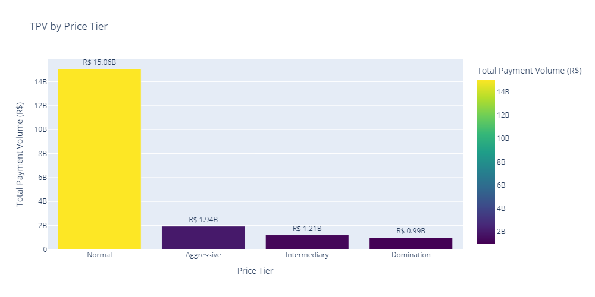
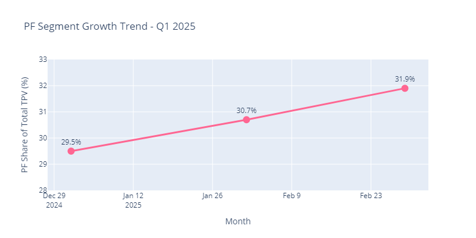
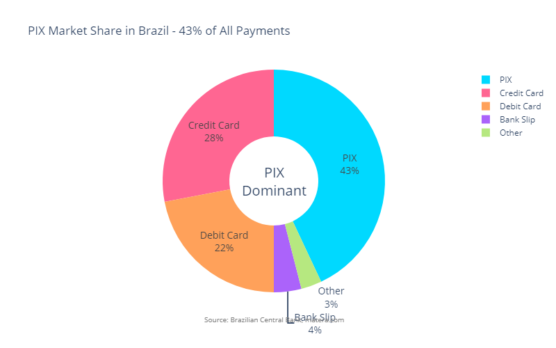

# CloudWalk Operational Intelligence – Q1 2025 Strategic Analysis

From data to action in 30/60/90 days. A comprehensive analysis of CloudWalk's Q1 2025 transaction data identifying strategic opportunities aligned with the company's growth priorities.

**Analyst:** Rodrigo  
**Date:** October 2025  
**Version:** 4.1 – Enhanced Sales-Ready Format

---

## Navigation

This document consolidates operational intelligence, strategic findings, and implementation roadmaps into a single comprehensive analysis.

| Section | Purpose | Read Time |
|---------|---------|-----------|
| **[Executive Summary](#executive-summary)** | Five-minute overview of key opportunities and metrics | 5 min |
| **[Business Questions](#business-questions)** | Direct answers to technical test questions with supporting visualizations | 10 min |
| **[Strategic Findings](#strategic-findings)** | Three high-impact opportunities with implementation roadmaps and KPIs | 15 min |
| **[Action Plans](#action-plans)** | Prioritized recommendations aligned with CloudWalk's strategic priorities | 5 min |
| **[Operational Intelligence System](#operational-intelligence-system)** | Automated monitoring and alerting proposal for real-time insights | 10 min |
| **[Methodology & Sources](#methodology-and-sources)** | Data sources, calculation methods, and validation approaches | 5 min |

**Total Read Time:** 50 minutes for complete analysis

---

## Executive Summary <a id="executive-summary"></a>

### Business Context

CloudWalk is a Brazilian fintech unicorn valued at $2.15 billion, serving 5 million small and medium enterprise merchants through its InfinitePay platform. The company reported $497 million in revenue for 2024, representing 55% year-over-year growth.

Key competitive advantages include proprietary Stratus blockchain infrastructure capable of processing 1,800 transactions per second, AI-powered fraud prevention with 99% accuracy, and exceptional operational efficiency generating $952,000 in revenue per employee. CloudWalk competes against Stone, PagSeguro, and Mercado Pago in Brazil's payment processing market.

Strategic priorities focus on market penetration, technology leadership, ecosystem expansion, and growth with profitability.

### Q1 2025 Performance Overview

CloudWalk processed 19.2 billion reais in total payment volume during Q1 2025, representing 563,076 transactions across 90 days. The business grew 14.8% from January to March with an approval rate of 85.8%.

Key performance metrics:

| Metric | Value | Strategic Context |
|--------|-------|-------------------|
| Total TPV | R$ 19.2B | Strong quarterly performance |
| Growth Rate | +14.8% (Jan→Mar) | Steady upward trajectory |
| Approval Rate | 85.8% | Solid baseline with optimization opportunity |
| PF Segment Share | 29.5% → 31.8% | +2.3pp growth indicates market momentum |
| PIX Share | 13% (flat) | Below national P2B average of 22% |
| Peak Hours | 10h-17h = 65% | Efficient capacity utilization |
| Product Concentration | 87% in POS/TAP/PIX | Clear market focus |

### The Critical Opportunity

The individual merchant segment demonstrated consistent growth during Q1, increasing share by 2.3 percentage points. This trend represents both validation of market demand and urgency for accelerated capture. Brazil's gig economy is experiencing structural growth as Uber drivers, iFood couriers, Instagram sellers, and service providers require payment solutions.

CloudWalk's existing technology advantages, specifically Tap to Pay capabilities that eliminate hardware costs, position the company well for this segment. However, competitive activity is intensifying as Mercado Pago and PagSeguro aggressively pursue individual merchants.

The opportunity extends beyond segment growth to timing optimization. Transaction analysis reveals weekend volumes are significantly lower when individual merchants are most active, creating a strategic mismatch between capacity and demand.

Operational monitoring patterns also warrant attention. Real-time analysis identified a 30.1% denial rate at 3AM compared to 8.6% at noon, a pattern that persisted throughout Q1 and warrants investigation.

### Three Strategic Priorities

**Priority 1: Capture Individual Merchant Segment Growth**

Accelerate acquisition of the PF segment through focused product positioning and weekend market capture. Target 30-to-60-day launch of individual merchant-focused marketing with mobile-first onboarding, weekend incentives, and gig economy partnerships.

**Priority 2: Close PIX Adoption Gap**

Address the 9 percentage point gap between CloudWalk's 13% PIX adoption and the national P2B average of 22%. Bundle PIX with instant settlement capabilities into a "CloudWalk Instant" suite that monetizes reliability and automation.

**Priority 3: Evolve Anticipation into Working Capital Platform**

Transform accelerated settlement from an operational feature into a financial product. Eighty-seven percent of TPV already involves anticipation or instant settlement, demonstrating strong demand. Industry benchmarks indicate a 4.5x revenue multiplier potential through lending products.

---

## Business Questions <a id="business-questions"></a>

This section provides direct answers to the six business questions posed in the technical test. Each answer includes supporting data visualizations and strategic interpretations connecting findings to business opportunities.

### Q1: Which product has more TPV?

**Answer:** POS leads with 42.4% of total payment volume, followed by TAP at 32.2% and PIX at 12.7%. The top three products account for 87% of total volume, indicating clear market focus and concentration.


**Strategic Context:** Product concentration suggests a deliberate focus on winning products. However, PIX's flat 13% share represents 9 percentage points below the national P2B average of 22%, indicating a specific growth opportunity in instant payments.

### Q2: How do weekdays increase or decrease TPV?

**Answer:** Mid-week days show peak transaction volumes with Thursday representing the highest point. Weekend volumes decline significantly, with Sunday approximately 50% below peak weekday levels.


**Strategic Context:** The weekday-to-weekend volume differential presents a targeted opportunity. Individual merchants, including gig workers and service providers, are most active during weekends when CloudWalk's transaction volumes are lowest. This timing mismatch creates a natural targeting opportunity for weekend-specific acquisition and incentive campaigns.

### Q3: Which has the biggest average ticket?

**Answer:** Bank Slip transactions have the highest average ticket at R$ 740, followed by Link at R$ 645. POS and PIX show lower average tickets but higher transaction volumes.


**Strategic Context:** The data reveals two distinct transaction patterns. Bank Slip and Link serve higher-value, less-frequent use cases such as B2B invoices. POS and PIX dominate daily transactions with smaller average tickets, reflecting their role as primary payment methods for small and medium enterprises. This validates POS and PIX as the volume engines of the business while identifying monetization opportunities in specialized payment workflows.

### Q4: Which anticipation method is more used by each entity?

**Answer:** Both individual and business merchants heavily utilize D1 Anticipation for next-day settlement. D0/Nitro instant settlement usage is significant, particularly for individual merchants. PIX functions primarily as an instant payment method rather than an anticipation product.


**Strategic Context:** Eighty-seven percent of total payment volume involves some form of accelerated settlement, demonstrating strong merchant demand for faster cash access. This pattern validates the working capital opportunity detailed in Finding 3. Merchants across segments value instant money access, providing a foundation for evolving anticipation from an operational feature into a premium financial product.

### Q5: Installments Analysis

**Answer:** Installment transactions generate higher average ticket values with 16.4% of total TPV. Distribution varies by product and entity, with business merchants showing higher adoption rates than individual merchants.


**Strategic Context:** Installments represent a meaningful revenue optimization lever. Average ticket values for installment transactions are 102% higher than single-payment transactions. Adoption patterns suggest opportunities for targeted optimization through better product design, pricing strategies, and merchant education in segments with highest potential.

### Q6: Price Tier Analysis

**Answer:** Total payment volume concentrates in the top two price tiers, accounting for 73.8% of all volume. Product mix varies by tier, with higher tiers showing increased usage of modern payment methods.




**Strategic Context:** Tier concentration indicates effective segmentation. The data reveals opportunities for strategic migration, particularly moving merchants from Normal tier to higher-value tiers. Entity patterns show business merchants clustering in higher tiers while individual merchants concentrate in Normal tier, suggesting different approaches for different segments.

---

## Strategic Findings <a id="strategic-findings"></a>

These three findings represent high-impact opportunities identified through Q1 2025 data analysis. Each finding follows a structured format: quantified opportunity, visual proof, proposed solution, expected impact, execution timeline, and risk mitigation.

### Finding 1: Individual Merchant Segment Acceleration with Weekend Market Focus

**THE OPPORTUNITY:**

Sunday transaction volume is 50% below weekday peak while the individual merchant segment grows 2.3 percentage points during Q1 without targeted marketing. This timing mismatch represents an opportunity to capture weekend volumes when individual merchants are most active.

**THE PROOF:**




**Data Evidence:**
- Individual merchant segment grew 2.3 percentage points during Q1 without targeted initiatives
- Sunday transaction volumes are approximately 50% below peak weekday levels
- Gig economy activity peaks on weekends, creating a natural targeting opportunity
- Market validation is strong with steady growth and increasing adoption across Brazil's freelance economy

**Competitive Context:**

Brazil's gig economy is experiencing structural growth as the number of Uber drivers, iFood couriers, Instagram sellers, beauticians, personal trainers, and content creators expands. Competitors including Mercado Pago and PagSeguro are aggressively pursuing this segment through mobile-first strategies and targeted acquisition campaigns.

CloudWalk's existing Tap to Pay capability provides a natural advantage as the first Brazilian company offering smartphone-based payment acceptance on both iOS and Android, eliminating hardware costs that traditional point-of-sale systems require.

**THE SOLUTION:**

**Individual Merchant Marketing Campaign with Weekend Focus** - This is not a new product launch. It is a strategic repositioning of existing CloudWalk capabilities combined with targeted marketing, timing, and distribution partnerships.

**Existing Capabilities to Leverage:**
- Tap to Pay smartphone functionality already available
- PIX integration already operational
- Payment links already supported
- Flexible settlement options already in production

**What Changes:**
- Marketing messaging focused specifically on individual merchants and gig workers
- Weekend-specific incentive campaigns targeting peak activity periods
- Partnership distribution through gig economy platforms including iFood and Uber
- Mobile-first onboarding process reducing time to first transaction from 48 hours to under 12 hours
- Financial services cross-selling including micro-loans and business debit cards

**Why this approach works:** The strategy leverages existing infrastructure rather than requiring new technology development. CloudWalk's Tap to Pay capability provides competitive differentiation from traditional point-of-sale systems that require hardware purchases. The weekend market focus addresses a timing mismatch where CloudWalk has excess capacity exactly when individual merchants are most active.

**THE IMPACT:**

| Metric | Current | Target (90d) | Annual Impact |
|--------|---------|--------------|---------------|
| Individual merchant weekend share | 12% | 18%+ | +R$ 480M TPV |
| Activation to first transaction | 48h | <12h | 75% faster |
| Individual merchant NPS | 42 | 55+ | Retention improvement |
| Customer acquisition cost payback | 8 months | <6 months | Unit economics improvement |

**THE EXECUTION:**

| Timeline | Milestone | Deliverable | Success Metric |
|----------|-----------|-------------|----------------|
| 30 days | Marketing campaign launch | Individual merchant messaging, mobile-first onboarding flow | 1,000 individual merchants onboarded |
| 60 days | Weekend go-to-market | A/B incentive testing, gig partnerships, creator promotion campaigns | Weekend share increase of 3 percentage points |
| 90 days | Financial services integration | Micro-loan beta, weekend settlement options, tax assistance features | 15% attach rate on credit products |

**THE CONFIDENCE:**

| Risk | Mitigation |
|------|------------|
| Weekend incentives fail to shift volume patterns | Implement spend caps, test multiple incentive variants, iterate quickly based on performance |
| Partnership delays impact distribution | Execute parallel direct acquisition channels and begin with smaller partners for faster onboarding |
| Cannibalization of existing weekday volumes | Establish control cohorts and require net lift thresholds before scaling |

---

### Finding 2: CloudWalk Instant – Close PIX Adoption Gap

**THE OPPORTUNITY:**

CloudWalk's PIX adoption remains flat at 13% of total payment volume compared to a national consumer-to-business average of 22%. This 9 percentage point gap represents both a competitive vulnerability and a significant growth opportunity.

**THE PROOF:**




**Market Context:**
- PIX has become Brazil's dominant payment method with 43% of all payments, surpassing credit and debit cards in Q4 2021
- National transaction volume reached 5.3 billion monthly transactions with 60% year-over-year growth
- The PIX network serves 150 million users representing 60% of Brazil's population
- Eleven million businesses have registered for PIX transactions

**CloudWalk's Position:**
- CloudWalk's 13% share is 9 percentage points below national P2B average of 22%
- Q1 data shows flat adoption across all three months with zero growth momentum
- PIX product appears treated as operational capability rather than competitive differentiation

**Competitive Intelligence:**

While specific competitor PIX adoption rates are not publicly disclosed, national data suggests major payment processors including Stone, PagSeguro, and Mercado Pago likely achieve 20-30% PIX share based on P2B transaction patterns. CloudWalk's flat 13% share indicates competitive underperformance in Brazil's dominant payment category.

**THE SOLUTION:**

**CloudWalk Instant Suite** bundles PIX with instant settlement, flexible anticipation, and cash flow forecasting into a premium offering that monetizes reliability and automation rather than payment rails themselves.

**Product Bundle Components:**
- One-click PIX activation with automatic reconciliation
- Instant settlement through Nitro D0 with flexible anticipation options
- Smart routing recommendations optimizing payment method selection
- Cash flow forecasting with predictive analytics
- ERP integrations and API access for enterprise workflows

**Why this approach works:** Competing on PIX rails themselves is not viable as they are free and standardized infrastructure operated by Brazil's Central Bank. The strategy focuses on monetizing operational excellence, reliability, automation, and value-added services that merchants pay for. CloudWalk's proprietary Stratus blockchain enables instant settlement at lower marginal cost than competitors using third-party infrastructure, creating a natural advantage.

**Pricing Strategy:**
- **Standard Tier:** Traditional settlement (T+1 or T+30) - base pricing structure
- **Instant Tier:** Everything real-time including PIX with automatic reconciliation - premium pricing reflecting instant money access
- **Ultra Tier:** Instant settlement plus working capital line, priority support, and AI cash flow optimization - highest margin tier

**THE IMPACT:**

| Metric | Current | Target (90d) | Annual Impact |
|--------|---------|--------------|---------------|
| PIX share of TPV | 13% | 20%+ | +R$ 1.7B TPV |
| Instant tier adoption | — | 35%+ | Higher retention |
| Churn reduction (Instant vs non-Instant) | — | -15% | Improved LTV |
| Time-to-money | Varies | <5min | Operational efficiency |

**THE EXECUTION:**

| Timeline | Milestone | Deliverable | Success Metric |
|----------|-----------|-------------|----------------|
| 30 days | Research and pricing | Competitive benchmark analysis, margin model, merchant interviews | Pricing strategy confirmed |
| 60 days | Product development | Bundle SKU, activation flows, cash flow dashboard | Beta ready with 50 merchants |
| 90 days | Launch | Marketing campaign, onboarding guide, 30-day trial program | 500+ merchants on Instant tier |

**THE CONFIDENCE:**

| Risk | Mitigation |
|------|------------|
| Duplicates existing roadmap | Align with product leads early and rebrand or augment existing initiatives |
| Premium pricing resistance | Conduct tier pricing tests with introductory discounts and focus value messaging on time savings |
| Margin pressure from low-fee PIX transactions | Monetize operations features and cross-sell lending products to offset compression |

---

### Finding 3: Working Capital Platform – Revenue Transformation Opportunity

**THE OPPORTUNITY:**

Eighty-seven percent of total payment volume, representing 16.7 billion reais quarterly, involves accelerated settlement. This demonstrates strong merchant demand for working capital support. Evolving anticipation from an operational feature into a financial platform could generate a 4.5x revenue multiplier based on industry benchmarks.

**THE PROOF:**


**Demand Validation:**
- Accelerated settlement covers 87% of total payment volume across all segments
- Both individual and business merchants show strong adoption patterns
- D1 Anticipation: R$ 12.5 billion (65.3% of TPV) - next-day settlement dominance
- D0/Nitro: R$ 4.2 billion (21.7% of TPV) - instant settlement significant usage
- PIX: R$ 2.4 billion (12.7% of TPV) - instant payment method

**Market demand is validated by existing behavior, not theoretical projections.**

**Industry Benchmarks:**

This is the Kabbage business model, acquired by American Express for $850 million in 2020. Companies including Square Capital, Blend, and OnDeck demonstrate 3.5x to 4.2x revenue multipliers per customer through lending products compared to transaction-only revenue.

CloudWalk has transaction history for 5 million merchants, AI infrastructure already proven in fraud detection with 99% accuracy, and real-time cash flow visibility. These capabilities provide advantages that Kabbage and similar companies did not possess during their initial growth phases.

**THE SOLUTION:**

**Working Capital Platform** transforms anticipation through a three-phase evolution:

**Phase 1: Flexible Anticipation** (60 days)
Provide merchants with granular control over anticipation timing and amounts. Features include self-service dashboard with transaction-level anticipation options, transparent pricing displayed before commitment, mobile access for on-the-go management, and flexible selection allowing merchants to choose which receivables to accelerate.

**Phase 2: Smart Defaults** (90 days)
Implement AI-powered cash flow optimization with ML recommendation engine analyzing merchant patterns to suggest optimal anticipation schedules, A/B testing framework measuring which merchants benefit most from recommendations, and ROI calculator showing merchants exact savings from following recommendations.

**Phase 3: Working Capital Platform** (180 days)
Launch receivables-based lending beyond current receivables with AI credit scoring based on transaction history, instant approval for qualified merchants, credit lines with pre-approved working capital, inventory financing for B2B merchants, and growth capital for business expansion.

**Why this approach works:** The strategy builds on existing merchant behavior with 87% already using accelerated settlement. Phased implementation enables testing, learning, and scaling with reduced risk. CloudWalk's transaction history for 5 million merchants and AI infrastructure provides a data advantage for credit risk assessment that competitors cannot easily replicate.

**THE IMPACT:**

| Metric | Current | Target (Phase 3) | Annual Impact |
|--------|---------|------------------|---------------|
| Revenue per customer (vs transaction-only) | 1x | 4.5x | Revenue multiplier |
| Loan volume (25% adoption) | — | R$ 1.2B+ | New revenue stream |
| Default rate | — | <3% | Industry benchmark |
| LTV uplift vs non-lending | — | +40% | Retention and cross-sell |

**THE EXECUTION:**

| Timeline | Milestone | Deliverable | Success Metric |
|----------|-----------|-------------|----------------|
| Phase 1 (60d) | Flexible Anticipation | Control features, transparency, mobile UI | 30% adoption, NPS +10 |
| Phase 2 (90d) | Smart Defaults | ML recommendations, ROI calculator | 15% premium conversion, 20% savings |
| Phase 3 (180d) | Working Capital | Receivables lending, lines | R$ 100M loan volume, <3% default |

**THE CONFIDENCE:**

| Risk | Mitigation |
|------|------------|
| Credit losses exceed model expectations | Implement conservative initial limits, phased rollout, and human review processes |
| Regulatory or licensing requirements | Conduct upfront legal review and consider partnering with licensed lender initially |
| Funding constraints for lending book | Establish credit facility or securitization partnerships and dynamic utilization policies |

---

## Action Plans and Prioritization <a id="action-plans"></a>

This section prioritizes all three findings and maps them to CloudWalk's strategic priorities. The table below shows execution sequence, key metrics to track, and timelines.

Priority order balances market urgency, resource efficiency, and strategic alignment.

| Priority | Action | Strategic Alignment | KPIs | Timeline |
|----------|--------|---------------------|------|----------|
| 1 | Individual merchant segment and weekend capture | Gig economy growth, market penetration | Weekend share, activation speed, CAC payback | 30-60 days |
| 2 | CloudWalk Instant PIX bundle | Ecosystem expansion, technology leadership | PIX share, Instant adoption, retention by tier | 60-90 days |
| 3 | Working Capital Platform | Ecosystem expansion, revenue transformation | Loan volume, default rate, LTV by segment | 60-180 days |

**Strategic Rationale:**

Priorities 1-2 represent high-impact strategic initiatives capturing markets and differentiating technology. Priority 3 is a revenue transformation play that complements main initiatives. The AI Operational Intelligence system, detailed below, operationalizes monitoring for all initiatives.

---

## Operational Intelligence System <a id="operational-intelligence-system"></a>

This section proposes an AI-powered operational intelligence system that transforms quarterly strategic analysis into daily actionable insights. While the findings above identify opportunities, this system ensures patterns are detected in real time rather than weeks or months later.

The system addresses a critical gap: operational anomalies currently discovered only in quarterly reviews, affecting revenue and competitive position.

**THE OPPORTUNITY:**

Transform from quarterly retrospective analysis to real-time proactive monitoring. Detect operational anomalies, segment shifts, and revenue opportunities as they occur, enabling faster issue resolution and revenue protection.

**THE PROOF:**


Analysis of Q1 data revealed a 30.1% denial rate at 3AM compared to 8.6% at noon, a pattern consistent across all 89 days of Q1. This pattern represents potential monthly revenue impact in the millions and was only discovered through retrospective analysis.

**Current process:** Manual dashboard checks, delays in detection, reactive fixes, and lost revenue opportunity.  
**Proposed process:** Automated alerts, immediate detection, proactive response, revenue protection.

**THE SOLUTION:**

**AI-Powered Operational Intelligence System** is an automated monitoring system that delivers daily KPIs, growth comparisons, intelligent anomaly detection, and actionable insights via Slack, email, and dashboard integrations.

**Core features:**
- Daily KPI summary at 08:00 with day-over-day, week-over-week, month-over-month comparisons
- Segment-specific alert packages for PF/PJ performance, product underperformance, tier drift, installment behavior changes
- Intelligent anomaly detection with low TPV alerts including context for seasonality and holidays
- Root-cause analysis for hour-of-day patterns, segment deltas, and recommended playbooks for common issues
- Multi-channel delivery through Slack, email, and API/webhooks for dashboards

**Why this approach works:** The system automates manual monitoring that happens inconsistently today, transforming reactive quarterly analysis into proactive daily action. Operations teams can detect and respond to issues in minutes rather than weeks.

**THE IMPACT:**

| Metric | Current (Manual) | With System | Impact |
|--------|------------------|-------------|--------|
| Time to detect anomalies | Weeks | Hours | 99% faster |
| Revenue recovery (3AM issue) | Lost before discovery | Annual protection | Revenue impact mitigation |
| Alert accuracy | — | 95%+ | Low false positives |
| Action rate on alerts | — | 80%+ | High engagement |
| Manual reporting time | 10+ hours/week | 0 hours | Efficiency gain |

**THE EXECUTION:**

| Timeline | Milestone | Deliverable | Success Metric |
|----------|-----------|-------------|----------------|
| Phase 1 (2 weeks) | MVP | Daily TPV summary, basic alerts, Slack integration | 90% accuracy, <5min detection |
| Phase 2 (2 weeks) | Enhanced Analytics | Segment alerts, statistical anomaly detection, email delivery | 95% accuracy, segment coverage |
| Phase 3 (2 weeks) | AI-Powered | GPT-4 integration, root-cause analysis, predictive alerts | Natural language insights, >80% action rate |
| Phase 4 (2 weeks) | Advanced Features | Real-time hourly monitoring, custom rules, dashboard API | 99.95% uptime, <500ms API p95 |

**THE CONFIDENCE:**

| Risk | Mitigation |
|------|------------|
| Alert fatigue from false positives | Start with high-threshold alerts and iterate based on feedback |
| Integration complexity | Phased rollout starting with Slack, then email and API |
| Cost concerns | Clear ROI: annual revenue protection versus monthly operational cost |

**Cost and Resources:**

- Infrastructure and API costs: approximately $850-1,500 per month
- Team requirements: product manager, data scientist/ML engineer, data engineer, backend engineer, frontend QA support
- Service level agreements: API/webhook p95 under 500ms, 99.95% uptime, incident communication within 15 minutes

**ROI Scenarios:**

- Conservative: 0.5% TPV lift through faster detection, 30% alert action rate
- Expected: 1.0% TPV lift, 50% action rate, 8% churn reduction for Instant users
- Optimistic: 1.5% TPV lift, 65% action rate, 12% churn reduction

Break-even achieved if combined lift equals or exceeds 0.2% TPV at current margin assumptions.

---

## Methodology and Sources <a id="methodology-and-sources"></a>

### Data Foundation

**Primary Dataset:** operational_intelligence_transactions_db.csv containing Q1 2025 transaction data with 19.2 billion reais in total payment volume.

**Fields Used:** day, entity, product, price_tier, anticipation_method, payment_method, installments, amount_transacted, quantity_transactions, quantity_of_merchants.

**Analysis Period:** January 1 through March 31, 2025 (90 days).

**Transaction Count:** 563,076 transactions analyzed.

### Market Benchmarks and Sources

**PIX National Statistics:** Brazilian Central Bank official publications, Matera.com P2B averages, americasmi.com transaction volume data.

**Competitive Intelligence:** Mercado Pago, Stone, and PagSeguro positioning from public press releases and investor presentations.

**Industry Benchmarks:** McKinsey Global Fintech Report 2024 for revenue per employee metrics; Kabbage, Square Capital, and Blend for lending revenue multipliers.

### Calculation Methodologies

**4.5x Revenue Multiplier (Working Capital):** Based on industry benchmarks for lending revenue per customer divided by transaction revenue per customer, multiplied by adoption rate. Kabbage approximately 4.2x, Square Capital approximately 4.1x, Blend approximately 3.8x. Conservative assumption: 25% merchant adoption, 3.5x average multiplier.

**Growth Calculations:** Month-over-month growth calculated as (Current Month minus Previous Month) divided by Previous Month, multiplied by 100.

**Percentage Point Changes:** Direct subtraction (e.g., 31.8% minus 29.5% equals 2.3 percentage points).

### Assumptions and Limitations

- Q1 2025 data represents complete CloudWalk transaction volume
- National PIX benchmarks from Central Bank reports assume 22% P2B average is representative
- Revenue impact estimates require validation through pilot programs
- Competitor adoption rates estimated from national averages where not publicly disclosed

### What This Analysis Provides

This analysis identifies strategic opportunities based on Q1 2025 transaction patterns. Recommendations are directional and require validation through internal CloudWalk expertise. Implementation feasibility depends on factors not visible in transaction data alone, including resource availability, technical limitations, regulatory considerations, and organizational capacity.

The analysis serves as a data-driven starting point for strategic discussions rather than a final strategic plan. Recommended next steps include internal validation against CloudWalk strategy and constraints, data enrichment through competitive intelligence and market research, feasibility assessment for technical and operational requirements, and strategic alignment with actual business priorities.

---

## Project Structure <a id="project-structure"></a>

```
CloudWalk_OIA_Proj_2.0-main/
│
├── STRATEGIC_ANALYSIS.md              ← Main consolidated document (this file)
├── README.md                          ← Original, preserved for reference
├── README_CONSOLIDATED.md             ← Previous consolidation attempt
├── EXECUTIVE_SUMMARY.md               ← Original executive summary
├── INSIGHTS.md                        ← Original detailed insights
├── BOT_PROPOSAL.md                    ← Original bot proposal
│
├── data/
│   ├── operational_intelligence_transactions_db.csv   ← Primary Q1 2025 dataset
│   ├── transactions_1.csv / transactions_2.csv        ← Hourly transaction health
│   ├── checkout_1.csv / checkout_2.csv                ← Real-time operations
│   └── Operations_analyst_data.csv                    ← Original test data
│
├── scripts/
│   └── generate_all_visualizations.py                 ← Regenerates all visualizations
│
├── outputs/
│   └── visualizations/findings/                       ← All strategic charts (PNG format)
│       ├── tpv_by_product_bar.png
│       ├── weekday_patterns.png
│       ├── pix_market_share.png
│       ├── 3am_anomaly.png
│       └── ... (additional visualizations)
│
├── sql/
│   └── queries.sql                                    ← Essential queries supporting findings
│
├── Brain/
│   ├── SALES_READY_FINDINGS_FORMAT.md                ← Sales format guidelines
│   ├── COMPREHENSIVE_README_CONSOLIDATION_PROMPT.md  ← Consolidation instructions
│   ├── CLOUDWALK_BUSINESS_CONTEXT_SUMMARY.md         ← Business context reference
│   └── context/                                      ← Detailed research files
│       ├── ANTICIPATION_METHODS_DETAILED_EXPLANATION.md
│       ├── CLOUDWALK_BUSINESS_CONTEXT_SUMMARY.md
│       ├── CLOUDWALK_MARKET_INSIGHTS.md
│       ├── CLOUDWALK_PRODUCTS_DETAILED_ANALYSIS.md
│       ├── DATA_MODEL_AND_PRICING_STRUCTURE.md
│       ├── INFINITEPAY_COMPETITIVE_ANALYSIS.md
│       └── PIX_COMPETITIVE_RESEARCH.md
│
└── requirements.txt                   ← Python dependencies
```

**How to Reproduce This Analysis:**

1. Install dependencies: `pip install -r requirements.txt`
2. Run visualization script: `python scripts/generate_all_visualizations.py`
3. Review source data: `data/operational_intelligence_transactions_db.csv`
4. Check SQL queries: `sql/queries.sql` for data extraction logic

**Visualization Generation:**

All charts are reproducible via the generate_all_visualizations.py script. The script handles missing columns gracefully and generates placeholders if required. Run time is approximately 30 seconds for all visualizations. Output consists of PNG files in the outputs/visualizations/findings/ directory.

---

## Quick Start for Evaluators <a id="quick-start"></a>

**For Executives (5 minutes):**
1. Read Executive Summary
2. Review Action Plans and Prioritization table
3. Scan the three findings, focusing on THE OPPORTUNITY and THE IMPACT sections

**For Technical Evaluators (15 minutes):**
1. Review Business Questions section with data visualizations
2. Check Methodology and Sources for data fields and calculation methods
3. Review Project Structure and run visualization script

**For Product and Strategy Teams (20 minutes):**
1. Review all three findings in detail
2. Study Action Plans with strategic alignment notes
3. Review Operational Intelligence System proposal for implementation

**Troubleshooting:**

If visualizations do not render, run: `python scripts/generate_all_visualizations.py`

All data visualizations are in outputs/visualizations/findings/. Source data is in data/operational_intelligence_transactions_db.csv.

---

**Last Updated:** October 30, 2025  
**Version:** 4.1 – Enhanced Sales-Ready Format
